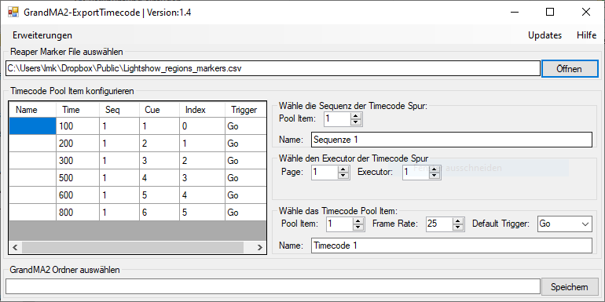

# GrandMA2-ExportTimecode

## Was ist das?
GrandMA2-ExportTimecode ist ein Tool, welches *.csv-Dateien aus Repaer, für MA Lightings' GrandMA2-Software konvertiert.
Reaper ist eine DAW-Software, in der man Marker in der Timeline setzten kann. Diese Marker kann man als *.csv-Datei exportieren.
Diese Datei kann von GrandMA2-ExportTimecode eingelesen werden, editiert werden und dann auf einen USB-Stick oder lokal gespeichert werden.
An einer GrandMA2-Konsole, wird dann mit Hilfe eines Makros automatisch die Sequenz sowie das Timecode-Poolitem erstellt.

## Wie funktioniert das?
Beim Starten des Tools, wird zuerst eine *.csv-Datei ausgewählt, die aus Reaper raus gespeichert wurde.
Dabei muss man darauf achten, dass im Region/Marker Manager nur die Marker aktiv sind und exportiert werden.
Zudem muss die Timeline auf der Einheit 'Hours:Minutes:Seconds:Frames' stehen.
GrandMA2-ExportTimecode ließt diese Datei ein und zeigt sie dem Nutzer an. Dieser kann dann einzelne Marker oder Cues bearbeiten, sprich
Zeiten anpassen, Nummern anpassen oder den Namen ändern. Zudem können weitere Einstellungen vorgenommen werden.
Danach kann man auf einem USB-Stick oder lokal ein Makro speichern. Dabei muss nur der GrandMA2-Ordner ausgewält werden, keine Unterverzeichnisse!
Dieses Makro wird in GrandMA2 importiert und dann ausgeführt. Es importiert automatisch die einzelnen Marker und speichert sie als Cues an die vorher festgelegte Stelle im Pult.
Zudem wird im Timecode-Pool ein Timecode-Poolitem erstellt, indem die die Cues an der richtigen Zeit getriggert werden.

## Wie bekomm ich das Tool?
In dem Ordner ExportReaperMarkersToGrandMA2/bin/Release/ die Datei [ExportReaperMarkersToGrandMA2.exe](ExportReaperMarkersToGrandMA2/bin/Release/ExportReaperMarkersToGrandMA2.exe) runterladen und ausführen!
